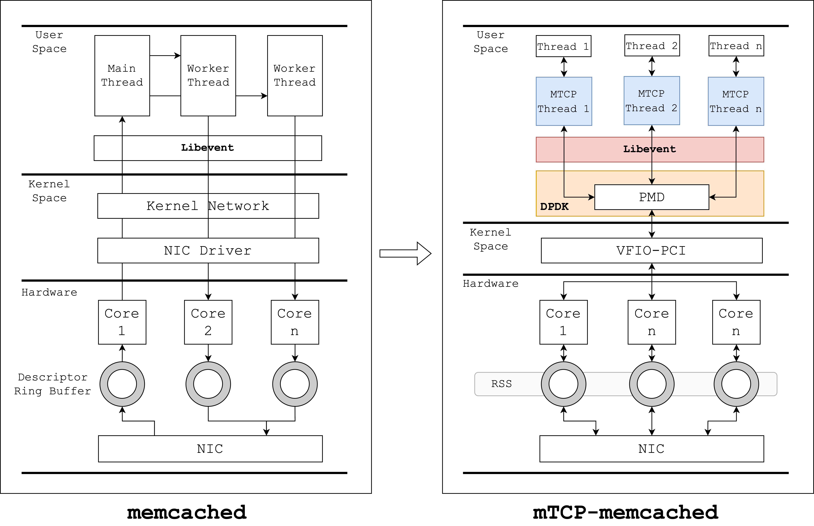

# mTCP-accelerated Memcached

<div align="center">
    
</div>

This repo contains a mTCP-accelerated Memcached implementation, based on DPDK-21.11. The main difference between origin memcached and this updated one is illustrated in the figure above. Briefly introduced, firstly the mTCP stack was modified to support DPDK 21.11; secondly the libevent library was also updated to contain epoll API from mTCP stack; finally the memcached, the origin network logic in the main thread was removed, where no listening UNIX port will be created, instead #threads of mTCP context will be created on corresponding CPU cores, and they’re all listen to the same TCP port, load balancing is rely on underlying RSS strategy.

## To Build

### 0. Prepare of DPDK-21.11

Make sure the header and library of DPDK 21.11 are installed correctly in your machine, and both the NIC and hugepage are under correct settings [ See <a href="https://zobinhuang.github.io/sec_learning/Tech_System_And_Network/DPDK_1_Installation/">Installation of DPDK 21.11</a> for more details ];

### 1. mTCP
Firtsly we need to compile and install mTCP. We have modified some code of mTCP, see <a href="https://zobinhuang.github.io/sec_learning/Tech_System_And_Network/DPDK_mTCP_Compiled/index.html">Guide to compile mTCP with DPDK 21.11</a> for more details about making mTCP capable with DPDK 21.11.

```bash
cd ./third_party/mtcp
./configure --with-dpdk-lib=$RTE_SDK/$RTE_TARGET
make install
```

### 2. libevent
Then we need to build and install mTCP-based libevent, simply run:

```bash
cd ./third_party/libevent
mkdir build && cd build
cmake ..
make install
```

### 3. Tool to manage DPDK-controlled NIC

Next, we need to build and run `dpdk-iface` which mTCP provides to manage DPDK-controlled NIC

```bash
cd ./third_party/dpdk-iface-kmod
export RTE_SDK=/usr/src/dpdk-21.11
make
insmod dpdk_iface.ko
./dpdk_iface_main
```

### 4. Memcached

To build memcached in your machine from local repo, you will have to install
autotools, automake and libevent. In a debian based system that will look
like this

```bash
sudo apt-get install autotools-dev
sudo apt-get install automake
sudo apt-get install libevent-dev
```

After that you can build memcached binary using automake

```bash
cd [Root of Memcached]
./autogen.sh
./configure
make

# optional
make test
```

It should create the binary in the same folder, which you can run

```bash
./memcached -u root
```

## To use

You can telnet into that memcached to ensure it is up and running

```bash
telnet 127.0.0.1 11211
stats
```

IF BUILDING PROXY, AN EXTRA STEP IS NECESSARY:

```bash
cd memcached
cd vendor
./fetch.sh
cd ..
./autogen.sh
./configure --enable-proxy
make
make test
```